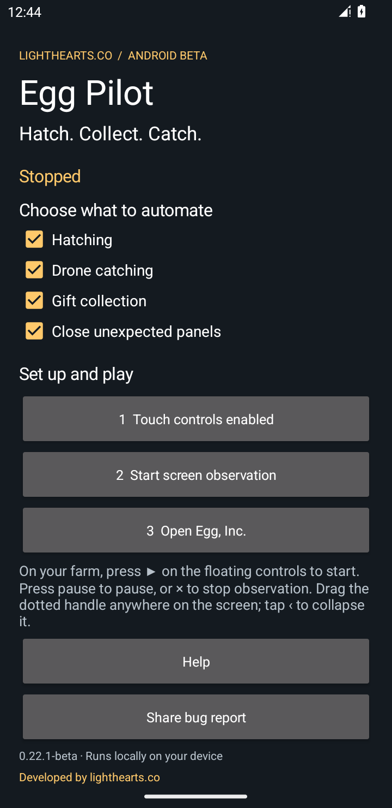
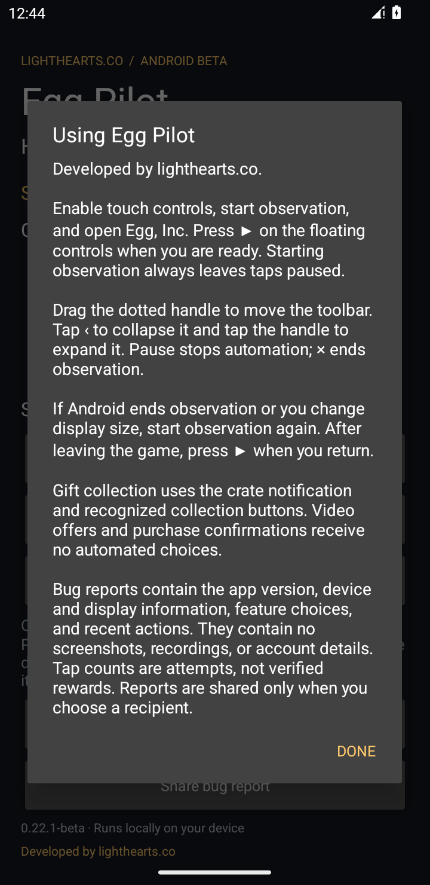

# Egg Pilot

An Android companion for Egg, Inc., developed by [lighthearts.co](https://lighthearts.co).

I built Egg Pilot for my wife after she’d been playing Egg, Inc. for a few weeks, and now I’m sharing it for everyone to use.

It’s an Android companion that helps with hatching, catching drones, and collecting gifts. I added the ability to close unexpected panels in the event of misclicks. You choose which features run, with movable controls to start, pause, or stop. Screen processing happens locally on your phone, and no data is sent automatically. Optional text bug reports are shared only when you choose to share them.

It’s a personal project developed by lighthearts.co, released as a beta. I’d love feedback on setup, how it behaves on different phones, and what would make it more useful, though I can't promise further development.

## Download

[Download Egg Pilot 0.22.1-beta](https://github.com/benniefolyfe/egg-pilot/releases/download/v0.22.1-beta/Egg-Pilot-0.22.1-beta.apk) · [Release notes](https://github.com/benniefolyfe/egg-pilot/releases/tag/v0.22.1-beta)

Requires Android 8.0 or newer and Egg, Inc. This is a companion app; it does not replace the game. Install the APK, or install it over an existing Egg Pilot beta to update.

## Set up and play

1. Choose which features to enable.
2. Enable **Egg Pilot controls** in Android Accessibility settings and return to Egg Pilot.
3. Start screen observation and approve Android's prompt.
4. Open Egg, Inc. and press **▶** on the floating controls.

Observation starts with automated taps paused. Pause stops automation; **×** ends observation. Drag the dotted handle to move the controls, tap **‹** to collapse them, and tap the handle to expand them.

## Screenshots

 

## Privacy

Screen images are processed locally and are not saved. Egg Pilot has no internet permission. It keeps recent diagnostic text on the device; **Share bug report** exports a text file through Android's share chooser only when you choose to share it. Reports include device/display details, selected features, and recent actions. They contain no screenshots or video recordings. Tapping the developer website link opens your browser.

## Beta status and feedback

The Android build, permissions/setup flow, floating controls, and optional report sharing have been checked. Drone testing used simulated flights; a live-game catch rate and physical-phone battery/heat behavior have not been established. Touch counters describe attempts rather than verified rewards.

[Discussion and questions](https://github.com/benniefolyfe/egg-pilot/discussions/1) and [problem reports](https://github.com/benniefolyfe/egg-pilot/issues) are welcome. Further development is not guaranteed.

This repository hosts release downloads, documentation, and screenshots. It is not a source-code release. Egg Pilot is an unofficial companion and is not affiliated with Auxbrain, the developer of Egg, Inc.
